<p align="center">
  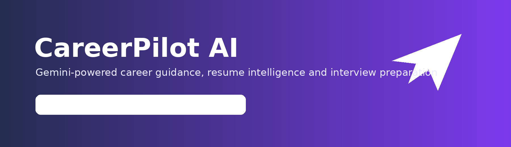
</p>

<h1 align="center">CareerPilot AI</h1>

<p align="center">
  An AI-powered career workspace that analyzes resumes, identifies skill gaps, prepares candidates for interviews, matches job descriptions, improves applications, and generates professional reports.
</p>

<p align="center">
  <a href="http://3.6.38.212"><strong>Live AWS Demo</strong></a>
  ·
  <a href="https://github.com/Keshavydv1255/CareerPilot-AI/releases/tag/v1.0.0"><strong>v1.0.0 Release</strong></a>
</p>

<p align="center">
  
  
  
  
  
  
</p>

---

## Overview

CareerPilot AI brings several career-preparation tasks into one resume-aware application. A candidate uploads a PDF resume once; the system extracts and stores its text, generates an ATS-style analysis, identifies missing skills, prepares a learning roadmap, and reuses the saved resume as context across the remaining AI tools.

The application is built with a modular FastAPI backend, Jinja2 templates, Bootstrap-based responsive UI, Google Gemini API integration, SQLAlchemy ORM, SQLite persistence, ReportLab PDF generation, and an AWS EC2 production deployment behind Nginx and systemd.

## Key Features

| Module | Capability |
|---|---|
| Resume Analyzer | Extracts PDF text, calculates an ATS-style score, detects skills, strengths, weaknesses, suggestions, and a learning roadmap. |
| AI Career Chat | Provides resume-aware career guidance and personalized improvement advice. |
| Interview Coach | Generates resume-based interview questions and evaluates candidate answers. |
| Job Matcher | Compares a resume with a job description and returns match score, matching skills, gaps, risks, and a preparation plan. |
| Resume Improver | Rewrites the uploaded resume for a selected target role without intentionally inventing experience. |
| Cover Letter Generator | Produces a company- and role-specific cover letter using saved resume context. |
| PDF Report | Downloads a polished analysis report generated from the saved report snapshot. |
| Dashboard Analytics | Stores and displays counts for resume analyses, AI chats, interviews, cover letters, job matches, improvements, and reports. |
| Reliability Layer | Retries temporary Gemini failures and provides a local ATS fallback when the external AI service is unavailable. |
| Dark Mode | Provides a shared responsive SaaS-style application shell with theme switching. |

## Application Screenshots

### Landing Page

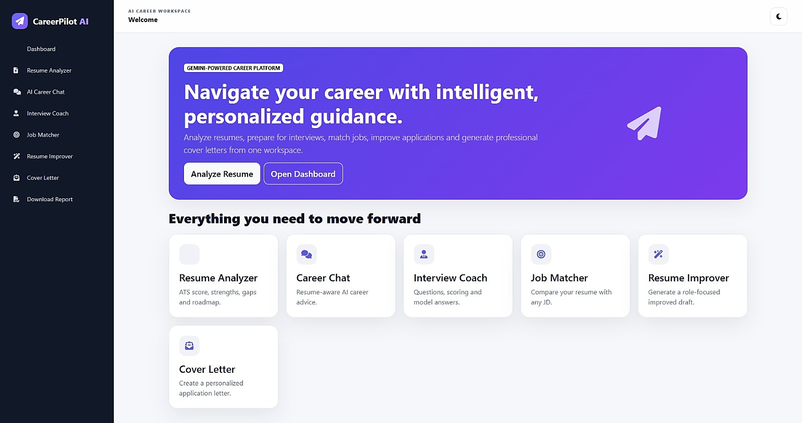

### Dashboard and Analytics

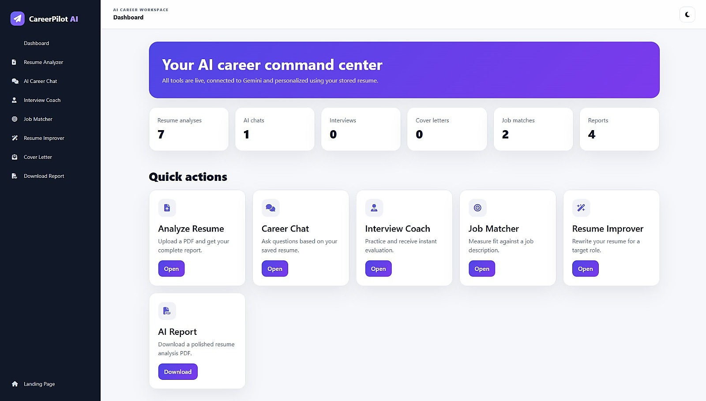

### Resume Analysis

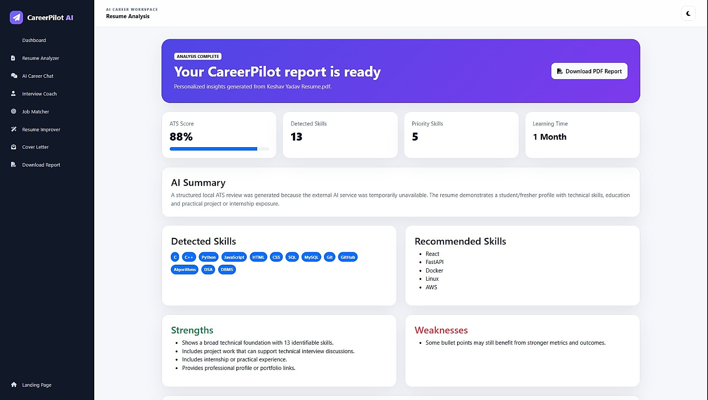

### Resume-Aware Career Chat

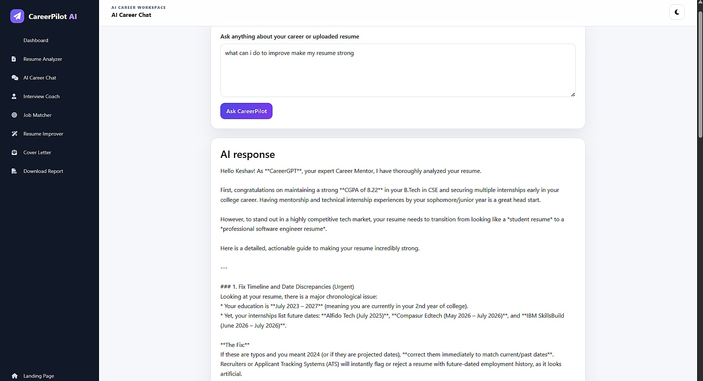

### Resume Improver

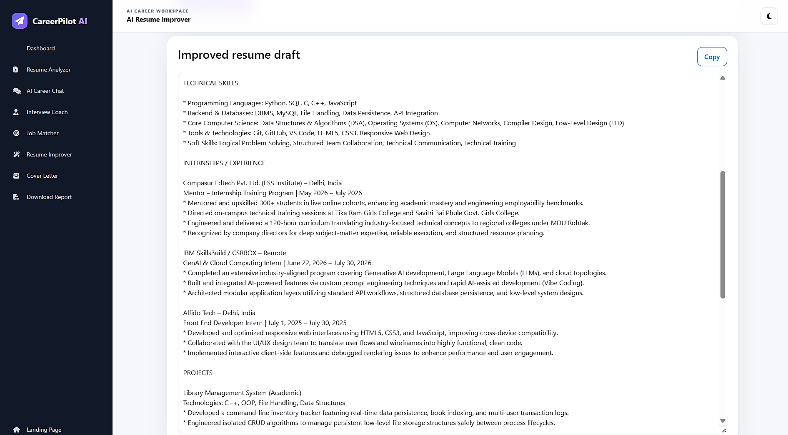

### Interview Coach

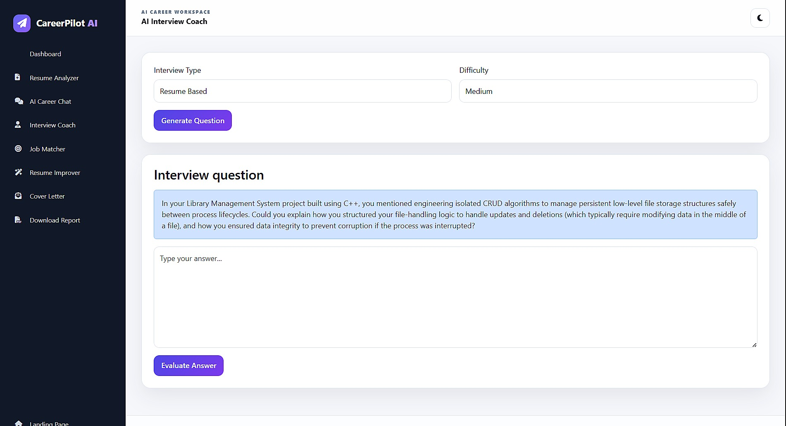

### Job Matcher

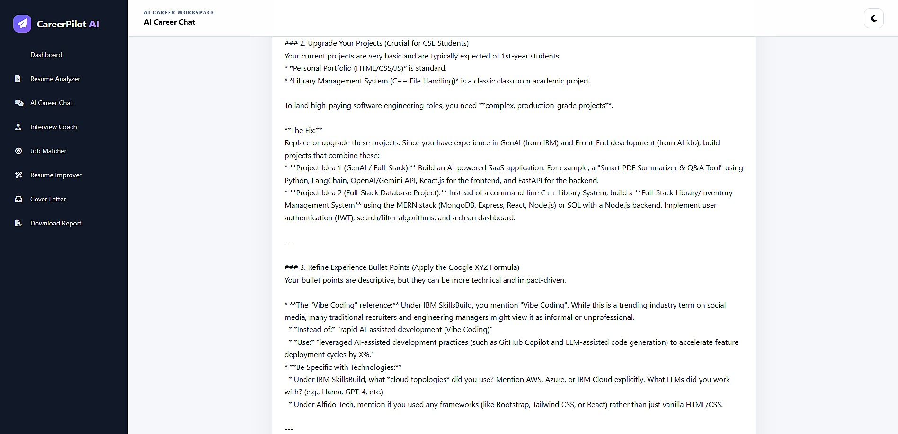

### Cover Letter Generator

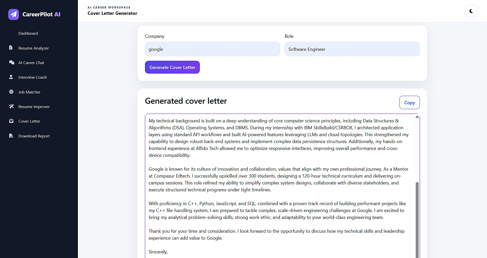

## System Architecture

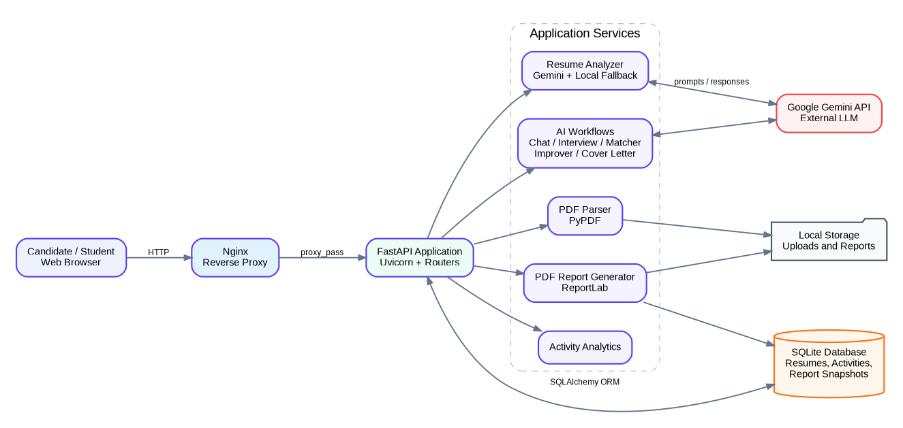

### Request Flow

1. The browser sends form data or a PDF upload to an appropriate FastAPI route.
2. The resume parser extracts text using PyPDF and stores the latest resume in SQLite.
3. AI workflows build task-specific prompts using stored resume context.
4. The Gemini service performs limited automatic retries for temporary quota or availability errors.
5. Structured results are rendered through Jinja2 templates.
6. Report snapshots and activity counters are stored through SQLAlchemy.
7. ReportLab produces a downloadable PDF without repeating an unnecessary AI request.

## AWS Deployment Architecture

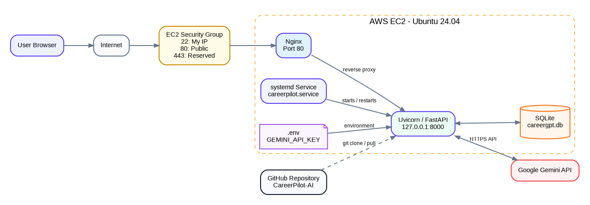

The current deployment uses:

- Ubuntu Server on Amazon EC2
- Nginx on port 80 as a reverse proxy
- Uvicorn/FastAPI bound internally to `127.0.0.1:8000`
- `careerpilot.service` under systemd for automatic startup and restart
- A security group exposing HTTP publicly and restricting SSH to the administrator IP
- `.env` on the server for the Gemini API key

> Current v1.0 is publicly available over HTTP using the EC2 public IP. A custom domain and HTTPS certificate are planned production enhancements.

## Technology Stack

### Frontend

- HTML5 and CSS3
- Jinja2 template inheritance
- Bootstrap 5
- Font Awesome
- Vanilla JavaScript

### Backend

- Python
- FastAPI
- Uvicorn
- PyPDF
- ReportLab
- `python-dotenv`

### AI and Data

- Google Gemini API via `google-genai`
- SQLAlchemy ORM
- SQLite

### Cloud and DevOps

- AWS EC2
- Ubuntu 24.04 LTS
- Nginx
- systemd
- Git and GitHub Releases

## Project Structure

```text
CareerPilot-AI/
├── app/
│   ├── database/
│   │   └── database.py
│   ├── models/
│   │   ├── activity.py
│   │   ├── report_snapshot.py
│   │   └── resume.py
│   ├── routes/
│   │   ├── chat.py
│   │   ├── cover_letter.py
│   │   ├── interview.py
│   │   ├── job_match.py
│   │   ├── report.py
│   │   ├── resume.py
│   │   └── resume_improver.py
│   ├── services/
│   │   ├── analytics.py
│   │   ├── gemini_service.py
│   │   ├── interview_generator.py
│   │   ├── pdf_parser.py
│   │   ├── report_generator.py
│   │   ├── report_snapshot.py
│   │   ├── resume_analyzer.py
│   │   ├── resume_db.py
│   │   ├── roadmap_generator.py
│   │   └── skill_gap.py
│   └── main.py
├── static/
│   ├── css/
│   └── js/
├── templates/
│   ├── base.html
│   ├── dashboard.html
│   ├── result.html
│   └── ...
├── reports/
├── .env.example
├── .gitignore
└── requirements.txt
```

## Local Installation

### 1. Clone the repository

```bash
git clone https://github.com/Keshavydv1255/CareerPilot-AI.git
cd CareerPilot-AI
```

### 2. Create a virtual environment

Windows PowerShell:

```powershell
python -m venv venv
.\venv\Scripts\activate
```

Linux/macOS:

```bash
python3 -m venv venv
source venv/bin/activate
```

### 3. Install dependencies

```bash
python -m pip install --upgrade pip
python -m pip install -r requirements.txt
```

### 4. Configure environment variables

Copy `.env.example` to `.env` and add a valid Gemini API key:

```env
GEMINI_API_KEY=your_api_key_here
GEMINI_MODEL=models/gemini-3.5-flash
```

Never commit `.env`, API keys, AWS private keys, uploaded resumes, or local database files.

### 5. Run the application

```bash
python -m uvicorn app.main:app --reload
```

Open `http://127.0.0.1:8000`.

## Reliability and Security

- Gemini credentials are loaded only from environment variables.
- The `.env` file is excluded from version control.
- Only PDF uploads are accepted by the resume route.
- Nginx isolates the internal FastAPI port from direct public access.
- Temporary Gemini `429` and `503` failures receive short retries and friendly error messages.
- Resume analysis includes a deterministic local fallback when the external model cannot respond.
- PDF generation reuses a saved analysis snapshot instead of consuming another AI request.

## Current Limitations

- Version 1.0 stores the latest resume rather than maintaining separate authenticated user profiles.
- SQLite is suitable for the present single-instance academic deployment but PostgreSQL would be preferable for multi-user scaling.
- AI output quality depends on the source resume, prompt context, model availability, and API quota.
- Generated content must be reviewed by the candidate before submitting a job application.
- The current interface uses standard request-response delivery rather than token-by-token streaming.
- Docker packaging and domain-based HTTPS are planned extensions.

## Future Roadmap

- Login and multi-user profiles
- Resume version history
- PostgreSQL migration
- Docker and Docker Compose
- HTTPS with a custom domain
- Streaming AI responses
- DOCX/PDF export for improved resumes and cover letters
- Rich Markdown rendering for AI output
- Voice-based mock interviews
- CloudWatch monitoring and CI/CD
- Live job API integration

## Authors

**Keshav Yadav**  
B.Tech Computer Science and Engineering  
HMR Institute of Technology & Management (GGSIPU)

**Punit Dabas**  
Project Team Member

## Academic Context

CareerPilot AI was created as a team project for the **Vibe Coding: Building & Deploying an AI Web Application on AWS** project work. The implementation demonstrates AI-assisted development, prompt engineering, full-stack integration, secure server-side API usage, cloud deployment, testing, and technical documentation.

## Responsible Use

CareerPilot AI is an educational project. ATS scores, skill recommendations, cover letters, interview feedback, and job-match results are advisory outputs and should not be treated as guarantees of recruitment outcomes.

---

<p align="center">
  Built with FastAPI, Gemini AI, SQLAlchemy, ReportLab and AWS EC2.
</p>
